# Dashboard

This tutorial covers the various aspects of the dashboard page.

If you have not [signed in](01_account.md#log-into-your-account) yet, you will not be able to access this page.

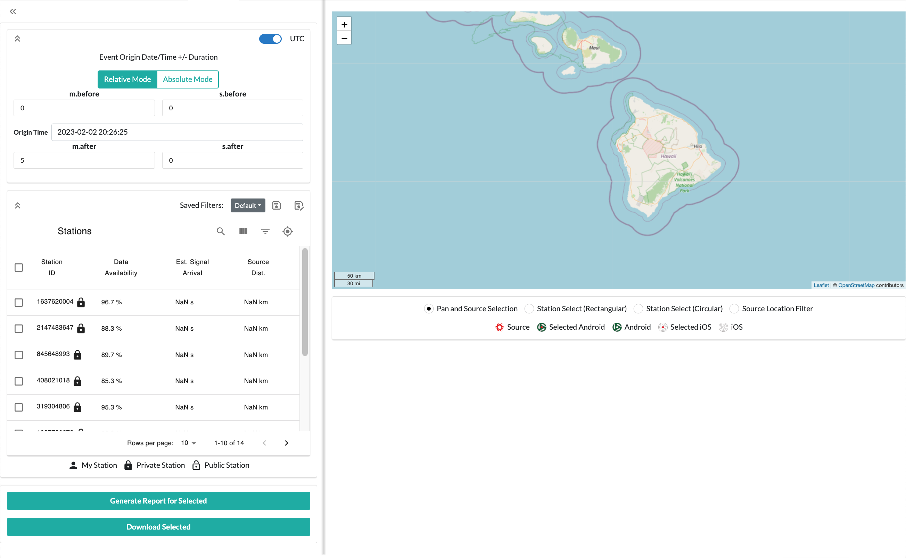

The dashboard is used to select a segment of time and a number of stations to get data or create a report of a signal 
of interest.  We will step through the various options available to you.

## Time Selection

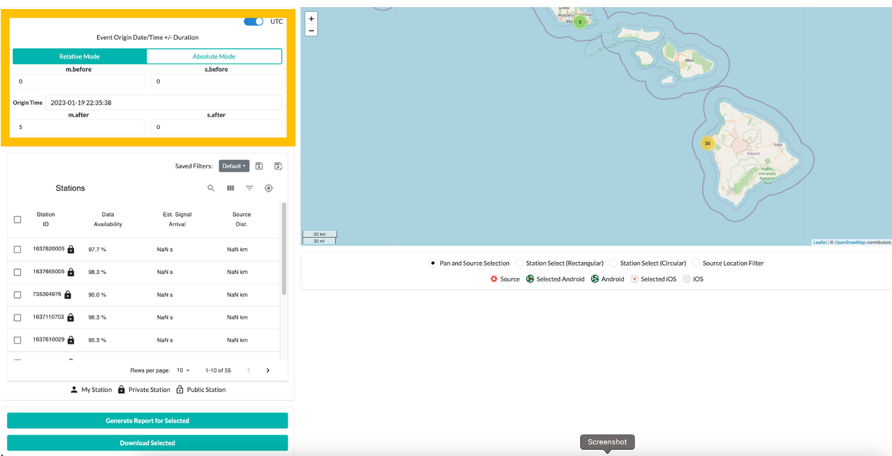

First, select the segment of time to get data for.  You can use either UTC or local time.  We strongly recommend using 
UTC, which is the default.

Next, use either relative or absolute values for the start and end of the segment.  We strongly recommend using 
relative mode, which is the default.

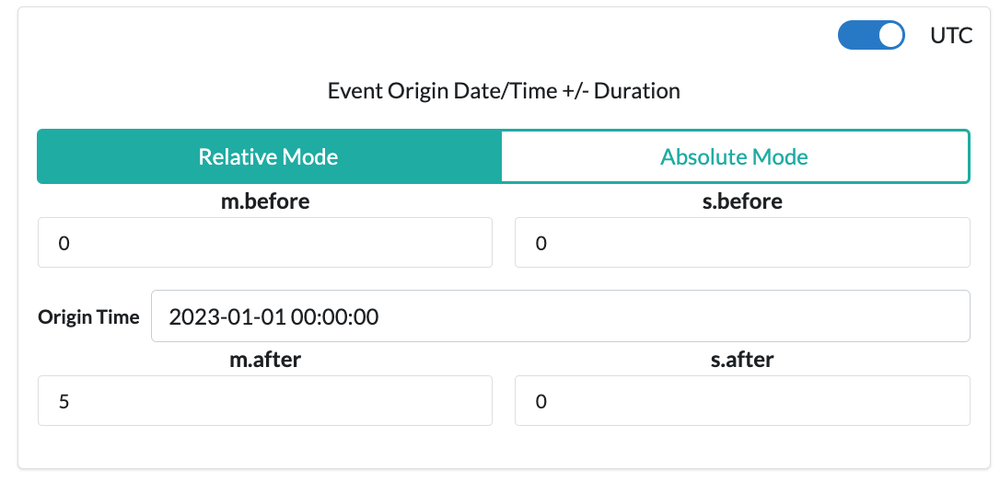

Relative time uses the origin time as the starting point for the selection, then adds the amount of time specified in 
the before and after sections.  The default amount of time to add is 5 minutes after the origin.  The origin defaults to 
5 minutes before the current time.

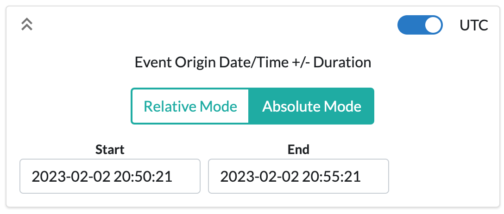

Absolute time requires both the start and end times of the segment to be entered.  The default end time is 5 minutes 
after the start time.  The start time defaults to 5 minutes before the current time.

## Source Location Selection 

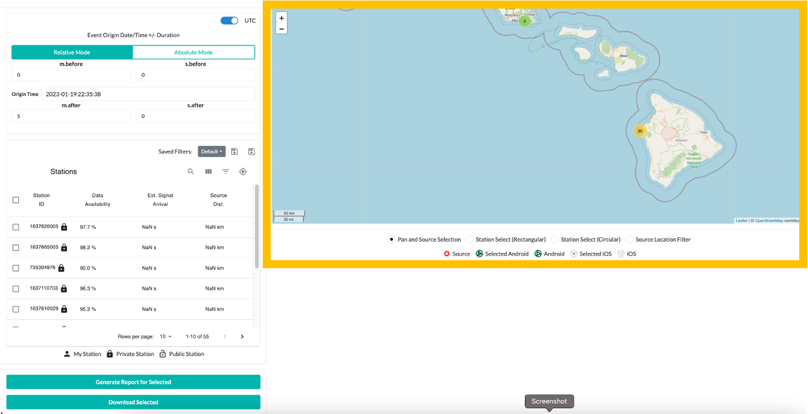

Choose a location that represents where the signal of interest starts from.  Your selection is represented by the red 
marker labeled `Source`.  The default option is to left-click on the map to select the location.  This is represented 
by the `Pan and Source Selection` option being selected.  You can left-click and hold, then drag your mouse to move the 
map.  Use your mouse wheel or the plus and minus in the upper left to zoom in and out.

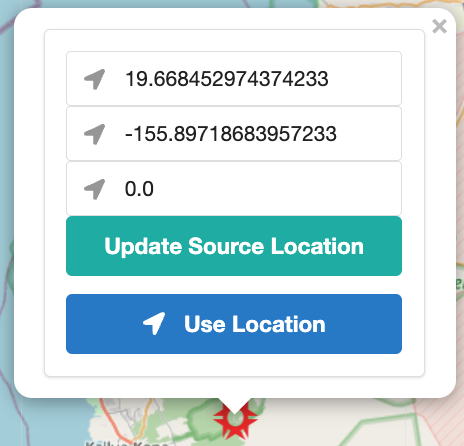

You can left-click on the red source location marker to change its values.  The first value is the latitude, the second
is the longitude, and the last is the altitude.  Latitude and longitude are in degrees, altitude is in meters.  Click 
the `Update Source Location` button to change the source location the new values.  If your browser has access to your 
location data, you can use the blue `Use Location` button to set the source location to your current location.  This 
will do nothing if your browser cannot access your location data.

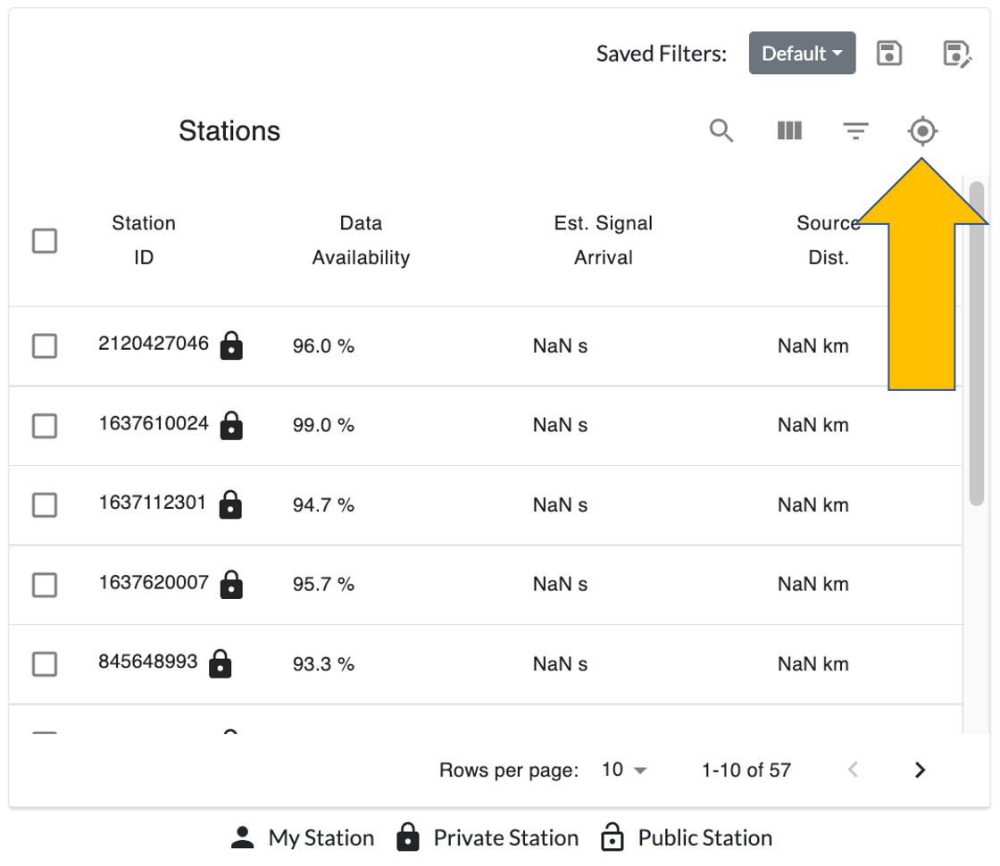

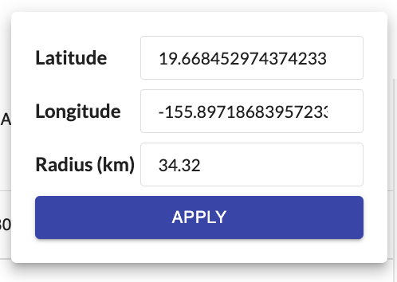

You can edit the source location by clicking on the bullseye icon in the search box.  Radius is in meters and refers to 
the area around the source location to select stations from.  Click `Apply` to set the location.

## Station Selection

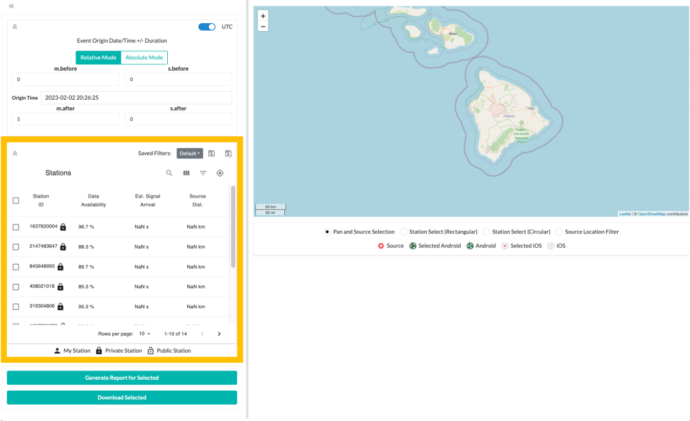

Next, select the stations to get data for.  By default, none of the stations are selected.  When you choose a source
location, the stations available are listed from closest to furthest from the source location.

There are a few ways to select stations:

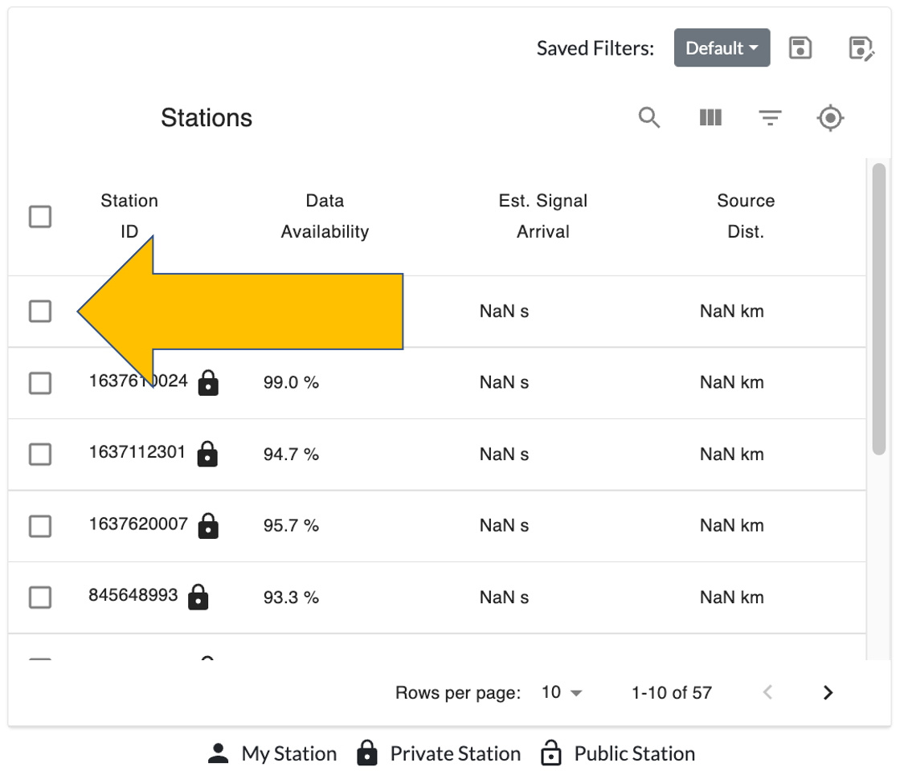

The first is to select a station by clicking on the checkbox to the left of the station ID.

You may also use one of the two options under the map display.

* `Station Select (Rectangular)`: Left-click and drag to create a rectangle.  All stations within the rectangle will be 
  selected.  If a station within the selection is already selected, it will be unselected.  We recommend clearing any
  previous selection by clicking the minus sign in the checkbox on the left of the station selection widget.  If 
  stations are selected, the top of the widget will look like this: 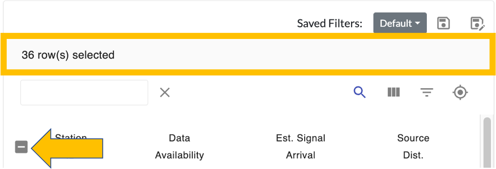

* `Station Select (Circular)`: Left-click and drag to create a circle.  All stations within the circle will be
  selected.  If a station within the selection is already selected, it will be unselected.  Refer to the previous entry 
  for precautions with previously selected stations.

### Filtering Displayed Stations

You have several options when filtering which stations to choose from.

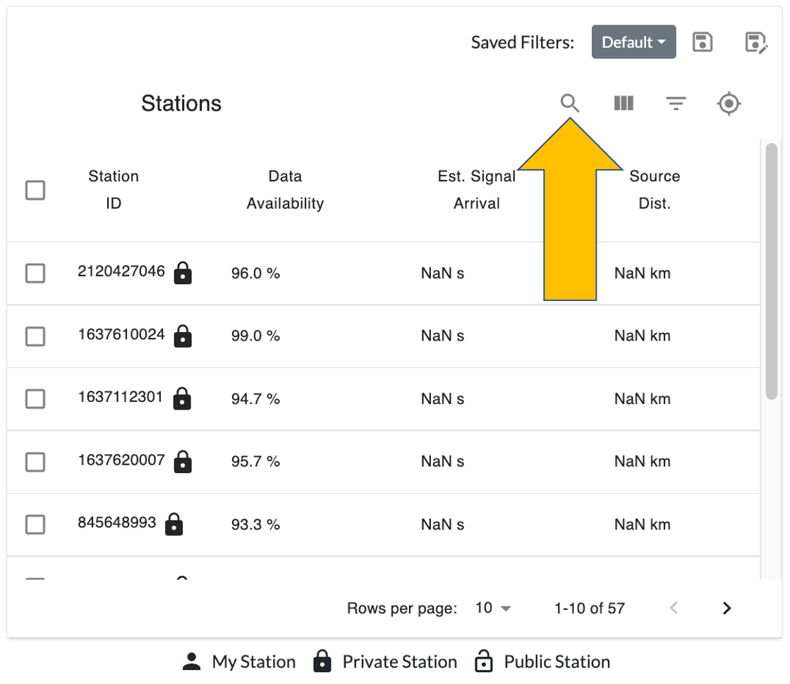

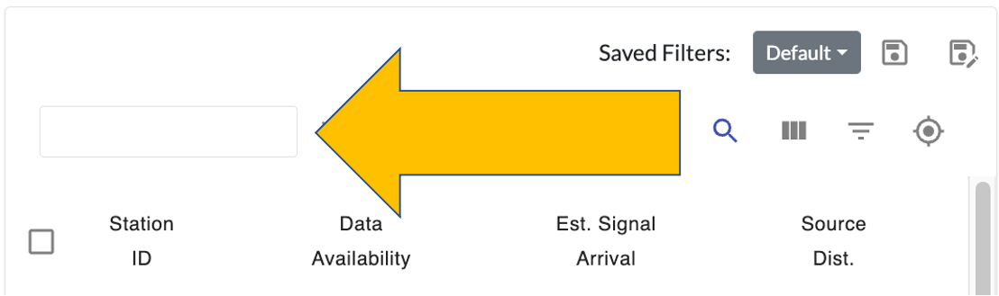

Search station ID values by clicking the magnifying glass icon and entering the values to search for in the text box
that appears on the left.  Stations that match your entered value will automatically update.

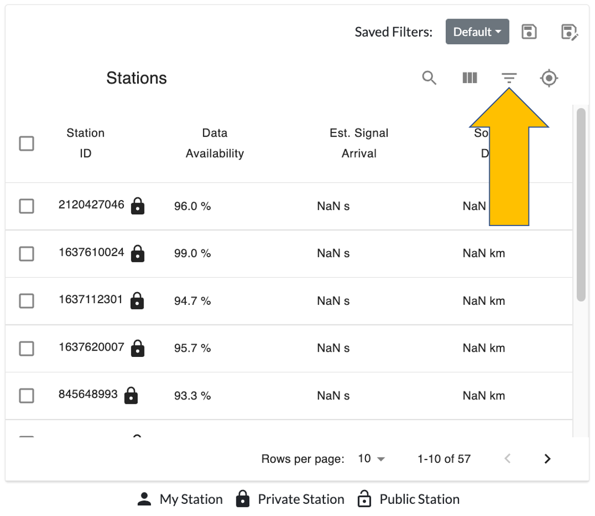

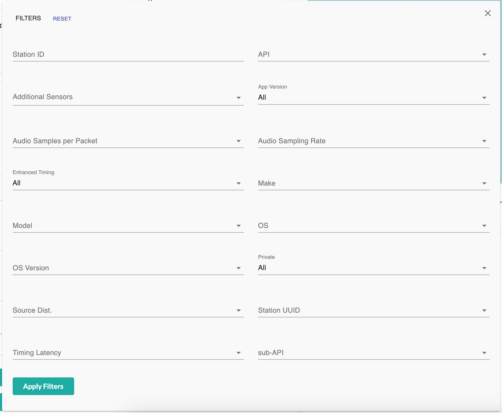

Click the inverted pyramid of three horizontal lines to display the station search filters.  Each option comes with its 
own selection widget.  Fill out the options you want, then click the `Apply Filters` button at the bottom.  You may 
need to scroll the filter selection box if the button does not appear.

The table below describes each option and gives a general idea of what values to expect.  The default option of all 
options is to not filter on the field.

|Field Name               |Type of Widget |Description   |
|-------------------------|---------------|--------------|
|Station ID               |Text box       |Fill in part or all of the Station ID to filter on.  Station IDs are typically numerical. |
|API                      |Checkbox       |Choose which version of API to filter on. |
|Additional Sensors       |Checkbox       |Choose one or more non-audio sensors required to be active on the Station. |
|App Version              |Dropdown       |Choose one of the App versions required to be running on the Station.  Note that there are options for both Android and iOS operating systems. |
|Audio Samples per Packet |Checkbox       |Choose one or more samples per packet to filter on. |
|Audio Sampling Rate      |Checkbox       |Choose one or more samples per second to filter on. |
|Enhanced Timing          |Dropdown       |Choose one to filter for stations synched to a time server, not synched to a time server, or all of the data. |
|Make                     |Checkbox       |Choose one or more Make of stations to filter on. |
|Model                    |Checkbox       |Choose one or more Model of the stations to filter on. |
|OS                       |Checkbox       |Choose one or more OS of the stations to filter on. |
|OS Version               |Checkbox       |Choose one or more OS Version of the stations to filter on. |
|Private                  |Dropdown       |Choose one to filter for private, not private, or all of the data. |
|Source Dist.             |Checkbox       |Choose one or more distance to source location.  Requires you to choose a source location first. |
|Station UUID             |Checkbox       |Choose one or more Station UUID to filter on. |
|Timing Latency           |Checkbox       |Choose one or more time sync server latencies of the stations to filter on. |
|sub-API                  |Checkbox       |Choose which sub-API version to filter on. |

* _Remember to press the `Apply Filters` button at the bottom to confirm your choices._

* _Please note that some combinations of choices may cause no results to be returned.  If this happens, update filter 
choices one at a time until you are satisfied with the results._

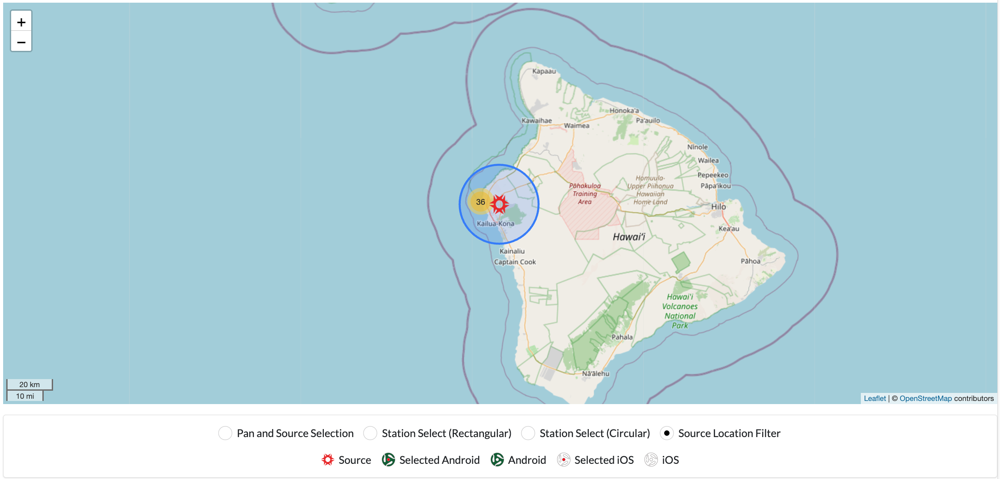

The `Source Location Filter` box under the map allows you to left-click and drag to create a circle centered on the
source location.  All stations within the circle will be selected if they previously were selected.  This option will 
limit which stations are included in the final report or data download.  Stations selected but are outside the circle 
will not be included.

## Filter Profiles

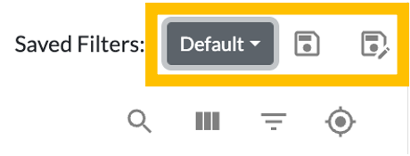

You can save the current filter profile by clicking on the disk icon.  Enter a descriptive name for the new profile, 
then click the `Add Filter` button.

You can load existing filter profiles by clicking on the dropdown icon.  Left click on the name of the profile you want
to load.  You can also remove profiles by clicking on the trashcan icon next to the name.

### Displaying Station Information

You have the option to change which information from each station is displayed to you.

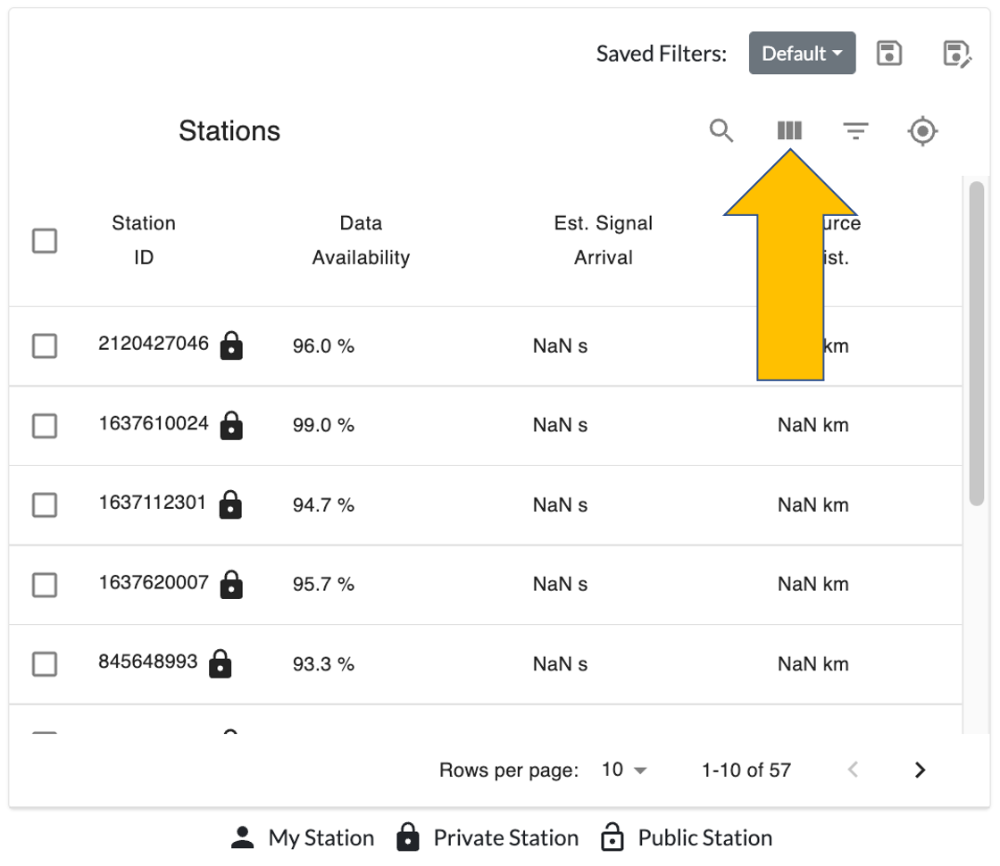

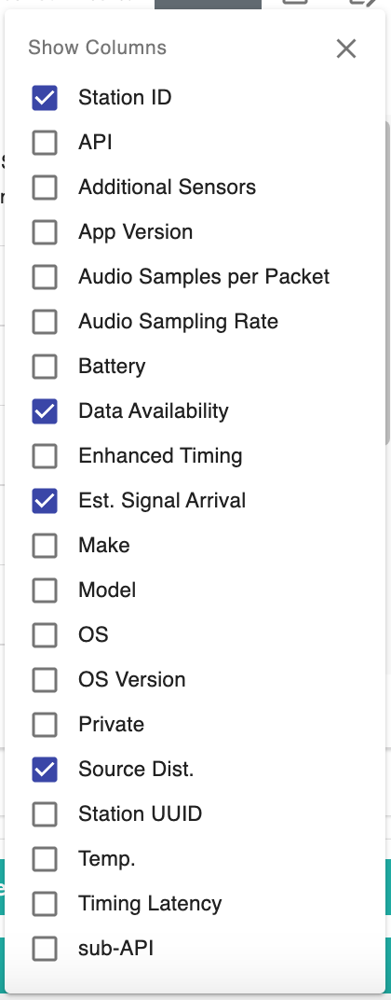

Click the three vertical lines to display the station column filters.  Select which column(s) you would like to be
displayed when searching for stations.  The default options are displayed in the screenshot.

## Generate Report

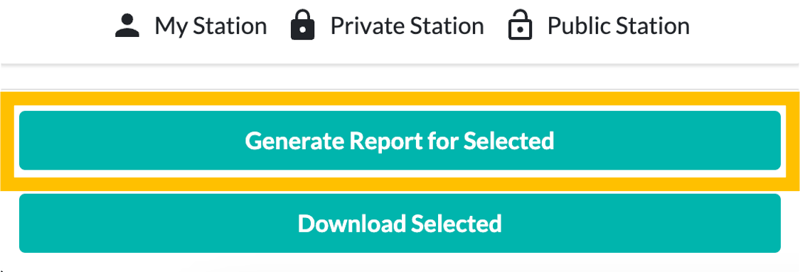

Click the `Generate Report for Selected` button to create a report for the selected data.  There is a progress bar 
indicating how far along the process has gone.  Longer segments of data will take longer to process, so please be 
patient.  Once the report has been generated, you can click on the link that appears to view the report.

More information about reports is available [here](03_report.md)

## Download Data

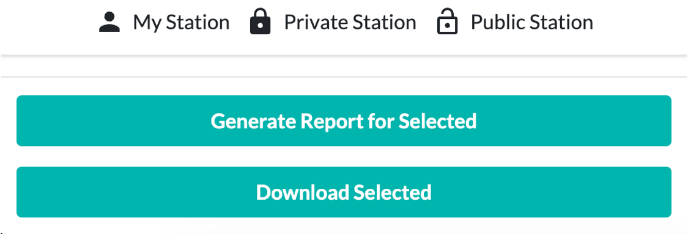

Click the `Download Selected` button to get the raw data files associated with the selected data.

You may use the [RedVox SDK](https://github.com/RedVoxInc/redvox-python-sdk) to access the files.

A [tutorial on using the RedVox SDK is available here](https://github.com/RedVoxInc/redvox-examples). 
