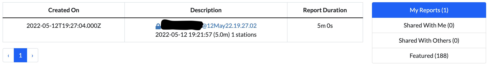
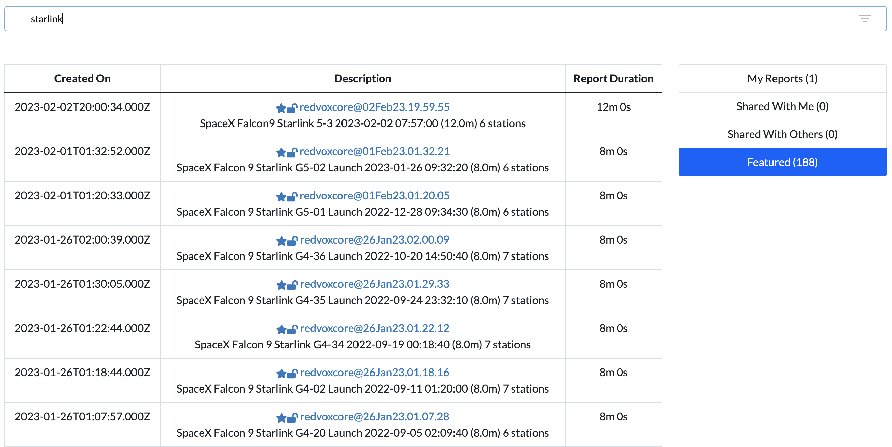
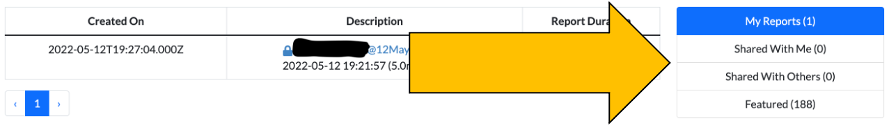
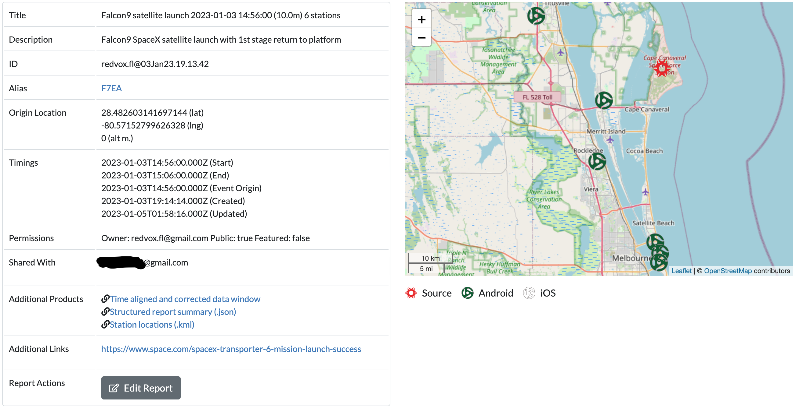
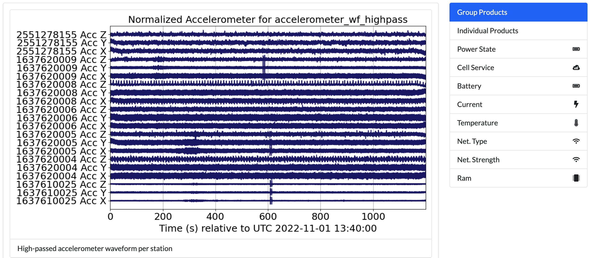

# Report

This tutorial covers the report search page and the report display page.

## Report Search

If you have not [signed in](01_account.md#log-into-your-account) yet, you will not be able to access this page.

This page lists all the reports available to you.  Reports are segments of data from one or more stations compiled 
together around an event of interest.  They are the easiest way to view RedVox data.

Each report is accessed through a link with the username of report's creator, followed by the @ sign, then the datetime 
of report creation.  Older or legacy reports will have a series of numbers and letters instead.  Below the link is the 
report title, which usually gives a brief description of the report.  By default, report titles are the datetime of the 
event of interest followed by the duration of the report window, followed by the number of stations in the report.

The lock symbol next to the report link indicates if a report is public or private.  Private reports can only be seen 
by the owners.

The star symbol next to the report link indicates if the report is featured.

To view a report, click on the link.  The [report will open](#report-page) in a new browser tab.

### Report Filters

Type in the search bar to filter by title.  Only reports with the entered keywords in their title will appear.

Select `My Reports` to view only the reports you have made.

Select `Shared With Me` to view only the reports shared with your account.

Select `Shared With Others` to view only the reports you have shared.

Select `Featured` to view only the reports featured as signals of interest.

## Report Page

The contents of a report are shown on this page.  You can access these pages without signing in if the report you are 
accessing is set to public display.  If you are unable to access a report, try logging in first.  If you cannot access 
a report and are logged in, check that the account you are using has access to the report.  As a last resort, contact 
[RedVox support](mailto:support@redvox.io) at `support@redvox.io`.

This table describes the fields of the report:

|Field Name          |Description   |
|--------------------|--------------|
|Title               |Title of the report that typically consists of an event of interest, the time of the event, the window duration, and the number of stations. |
|Description         |A short description of the event of interest. |
|ID                  |The identifier to the report.  Consists of the report creator's username and the date of report creation. |
|Alias               |A shortened alias link to the report.  Useful for sending a link to others without taking up a lot of space. |
|Origin Location     |The coordinates of the event of interest. |
|Timings             |The start and end of the report window, the time of the event origin, and the times of creation and last update of the report. |
|Permissions         |Owner of the report, if the report is viewable by anyone, and if the report is featured. |
|Shared With         |The users who have the same permissions as the owner of the report. |
|Additional Products |Includes the [Data Window](https://github.com/RedVoxInc/datawindow-examples) used to create the report, a .json report summary, and visualizations of the data. [More information here](03_report.md#additional-products). |
|Additional Links    |Links to outside resources for the event of interest. |
|Report Actions      |Click on the [Edit Report](03_report.md#edit-report) button to access options to edit the above fields, add more data products, or redo the report. |
|Report Map          |To the right of the report fields is a map showing the event of interest's location and the location of each station. |

Below the report summary are the data visualization products for sensors and state of health.

This table describes the visualization products:

|Product Name        |Description   |
|--------------------|--------------|
|Group Products      |Data is displayed per sensor across all stations.  Default display. |
|Individual Products |Data is displayed per sensor per station. |
|Power State         |Displays the power state of each station. |
|Cell Service        |Displays the cellular service state of each station. |
|Battery             |Displays the battery percent remaining of each station. |
|Current             |Displays the battery current in microamperes of each station. |
|Temperature         |Displays the temperature in Celsius of each station. |
|Net. Type           |Displays the network type of each station. |
|Net. Strength       |Displays the network strength in decibels of each station. |
|Ram                 |Displays the amount of RAM available of each station. |

* _Some state of health metrics may not be available for older reports._

## Additional Products

This table describes the additional products:

|Product Name        |Description   |
|--------------------|--------------|
|Data Window         |Listed as `Time aligned and corrected data window`; this is the [Data Window](https://github.com/RedVoxInc/datawindow-examples) used to create the report. If you want to dig into the data, use this. |
|Report Summary      |Listed as `Structured report summary (.json)`; this is a .json file containing the summary report.  Use this to view a quick overview of the report. |
|Station locations   |Listed as `Station locations (.kml)`; this is a .kml file that contains the locations of all the stations in the report. |
|ML Classification   |Listed as `*EVENT CLASS* classification timeline (.csv)`; this is a .csv file of the machine learning classifications for a particular type of event denoted by `*EVENT CLASS*`. |

* _Some reports may not have any ML classifications.  There are several ML classifications of interest, and reports 
may contain more than one .csv file._

* _You can view the ML classification files using the [YAMNet example](https://redvoxinc.github.io/redvox-examples/06_get_yamnet_classifications.html)._

## Edit Report

If you own a report, you may edit it.  Click the `Edit Report` button at the bottom of the report summary.

You will be able to edit:
1. Report title
2. Description
3. Alias link (we do not recommend changing this)
4. Public and featured tags
5. Which accounts the report is shared with
6. Additional URLs

* _When editing the shared accounts and additional URLs, you must click the green plus button to add the value and the 
red x to remove them.  If you do not use those buttons, your changes will not be saved._
* _When editing the additional URLs, you may include a description to display instead of the actual link text._

The Report Actions box will expand with more options described in the table below:

|Option               |Description   |
|---------------------|--------------|
|Save                 |Saves all changes. |
|Copy                 |Creates another report that's an exact copy of the current report. |
|Spect                |Creates spectrograms of the data. |
|Small Arms Detection |Run the Small Arms Detection ML on the data. |
|YamNet ML            |Run the YAMNet ML generic classifier on the data. |
|YamNet ML Lite       |Run the YAMNet ML generic classifier TF-lite version on the data. |
|Explosion ML         |Run the Explosion ML classifier on the data. |
|Explosion ML Lite    |Run the Explosion ML classifier using TF-lite on the data. |
|Ignition ML          |Run the Ignition ML classifier on the data. |
|Ignition ML Lite     |Run the Ignition ML classifier TF-lite version on the data. |
|Rocket ML            |Run the Rocket ML classifier on the data. |
|Rocket ML Lite       |Run the Rocket ML classifier TF-lite version on the data. |
|Extract Edge ML      |Retrieve the ML classifier data from the stations. |
|Redo                 |Returns you to the dashboard to change the report parameters.  Will create a new report. |
|Cancel               |Cancels any edits and returns you to the display view. |
|Delete               |Permanently removes the report.  A prompt will appear asking you to confirm deletion.  Click `Delete Report` to delete the report.  You will be returned to the report search page. |

* _When creating spectrograms or running ML classifications, a message will appear prompting you to wait for the process
to finish.  Refresh the page when the prompt directs you to view the product._

* _More information about TF-lite available at [tensorflow.org/lite](https://www.tensorflow.org/lite)._ 
